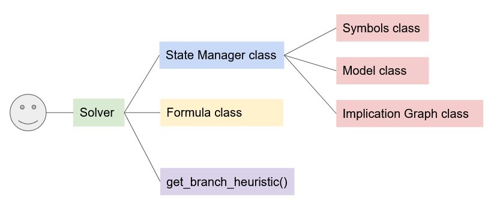

Below is an explanation of the overall architecture of the program,
including reasons on why we chose certain algorithms/heuristics over others
when implementing the CDCL Solver.

# Architecture

- The program's entry point is `main.py`, which calls the core CDCL logic in the Solver class in `./internal/sat/solver.py`

# Program Flow Outline
- The program first reads command-line flags in `main.py`.
- It then creates a Solver instance, and retrieves the branch heuristic
based on what was specified in the `--branch-heuristic` flag
- On instantiation, the Solver instance also accepts a Model, Formula and Symbols.
- The Solver changes the state of Symbols (unassigned/assigned symbols) and the Model (backtracking, etc)
through an abstraction called the State Manager.

# Overview of core classes
The core classes of this implementaion are `Solver`, `Formula`, `Symbols`, `Model`, `ImplicationGraphNode` and `StateManager`.

## Solver
The main driver of the CDCL algorithm. Implements methods necessary for CDC. Main responsibilities:

- CDCL Algorithm
- Unit propagation
- Conflict analysis
- Backtracking
- Resolution

## Formula
Represents a CNF formula. Holds both clauses in given formula and learnt clauses. Main responsiblities:

- get clauses (both learnt/given)
- add clauses (both learnt/given)

## Symbols
Represents the literals in a given formula. Main responsibilities:

- add symbol (unassigned literal)
- remove symbols (when literal is assigned)

## Model
Represents the mapping of symbols to their truth assignments. Main responsibilities:

- get symbol status (true or false)
- get clause status (unit/SAT/UNSAT)
- get formula status (SAT/UNSAT)

## StateManager
Represents a Facade (design pattern) that the Solver calls. Simplifies the interface for the Solver. Main responsibilities:

- Decouples the main CDCL algorithm and its underlying state 

## ImplicationGraphNode
Represents a node in the implication graph generated generated during CDCL. Main repsonsibilities:

- stores data necessary to generate the implication graph (children, parents, antecedent...)